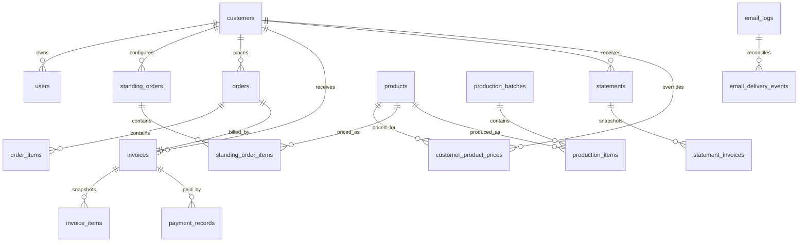

# StoryCoffee Database Schema

StoryCoffee uses PostgreSQL through EF Core migrations. The source of truth is:

- EF model: `backend/src/StoryCoffee.Infrastructure/Data/AppDbContext.cs`
- Entity models: `backend/src/StoryCoffee.Domain/Models`
- Migrations: `backend/src/StoryCoffee.Infrastructure/Migrations`
- Database startup: `backend/src/StoryCoffee.Api/Extensions/DatabaseExtensions.cs`

## Migration Commands

```bash
dotnet ef migrations add <Name> --project backend/src/StoryCoffee.Infrastructure --startup-project backend/src/StoryCoffee.Api --output-dir Migrations
dotnet ef database update --project backend/src/StoryCoffee.Infrastructure --startup-project backend/src/StoryCoffee.Api
```

The API applies pending migrations automatically on startup for relational databases. API integration tests use PostgreSQL/Redis Testcontainers; unit-style service tests use EF InMemory with `EnsureCreated`.

Demo seed data is isolated behind `SeedData` options:

- `SeedData:Enabled` forces seed execution for the current environment.
- `SeedData:EnableInDevelopment` allows local development seed data.
- `SeedData:EnableInTesting` allows integration/unit test seed data.
- Production defaults should keep all seed toggles disabled unless a controlled bootstrap process explicitly enables them.

## Tables

| Table | Purpose | Key Columns |
| --- | --- | --- |
| `customers` | Customer accounts and billing profile | `Id`, `BusinessName`, `Email`, `PaymentTerms`, `AccountStatus`, `CreatedAt` |
| `users` | Login identities for Admin and Customer roles | `Id`, `Email`, `PasswordHash`, `DisplayName`, `Role`, `CustomerId`, `IsActive`, `LastLoginAt` |
| `products` | Coffee product catalog | `Id`, `Sku`, `Name`, `Unit`, `Price`, `Cost`, `IsActive` |
| `customer_product_prices` | Customer-specific product price overrides | `Id`, `CustomerId`, `ProductId`, `OverridePrice`, `IsActive`, `Notes`, `CreatedAt`, `UpdatedAt` |
| `standing_orders` | Recurring order rules per customer | `Id`, `CustomerId`, `Frequency`, `NextClosingDate`, `Status`, `DeliveryNotes`, `InternalNotes` |
| `standing_order_items` | Products and quantities in a standing order | `Id`, `StandingOrderId`, `ProductId`, `Quantity`, `UnitPrice`, `Notes` |
| `orders` | Generated customer orders | `Id`, `OrderNumber`, `CustomerId`, `StandingOrderId`, `GeneratedAt`, `OrderStatus`, `InvoiceStatus`, `ShipmentStatus`, totals |
| `order_items` | Order line snapshots | `Id`, `OrderId`, `ProductId`, `ProductNameSnapshot`, `SkuSnapshot`, `Quantity`, `UnitPriceSnapshot`, `LineTotal` |
| `invoices` | Invoice lifecycle and PDF/email state | `Id`, `InvoiceNumber`, `CustomerId`, `OrderId`, `IssueDate`, `DueDate`, totals, `Status`, `EmailStatus`, `PdfFileKey` |
| `invoice_items` | Invoice line snapshots copied from order items | `Id`, `InvoiceId`, `Description`, `Quantity`, `UnitPrice`, `LineTotal` |
| `payment_records` | Payment entries and void metadata | `Id`, `InvoiceId`, `Amount`, `PaymentDate`, `PaymentMethod`, `Reference`, `MarkedByUserId`, `IsVoided`, `VoidedAt`, `VoidReason` |
| `statements` | Customer statement headers | `Id`, `StatementNumber`, `CustomerId`, period dates, `TotalOutstanding`, `Status`, `EmailStatus`, `PdfFileKey` |
| `statement_invoices` | Statement invoice snapshots | `Id`, `StatementId`, `InvoiceId`, invoice number/date/amount/status snapshots |
| `production_batches` | Production run headers | `Id`, `BatchNumber`, `ProductionPeriod`, `Status`, `CreatedAt`, `UpdatedAt`, `CreatedBy`, `UpdatedBy` |
| `production_items` | Aggregated production requirements by product | `Id`, `ProductionBatchId`, `ProductId`, product snapshots, `TotalQuantity`, `ProducedQuantity`, `Status` |
| `audit_logs` | Business action audit trail | `Id`, `ActorUserId`, `ActorRole`, `Action`, `EntityType`, `EntityId`, `OldValues`, `NewValues`, `CreatedAt` |
| `email_logs` | Email send outcome records | `Id`, `RelatedEntityType`, `RelatedEntityId`, `RecipientEmail`, `Subject`, `Status`, `Provider`, `ProviderMessageId`, `LastProviderEventType`, `ErrorMessage`, `SentAt` |
| `email_delivery_events` | Provider webhook delivery/bounce events | `Id`, `EmailLogId`, `Provider`, `ProviderEventId`, `ProviderMessageId`, `EventType`, `RecipientEmail`, `Reason`, `ReceivedAt` |
| `job_execution_logs` | Scheduled job execution history | `Id`, `JobName`, `Status`, `StartedAt`, `CompletedAt`, processed/succeeded/failed counts |
| `outbox_messages` | Durable side-effect retry queue | `Id`, `Type`, `Payload`, `Status`, `Attempts`, `AvailableAt`, `ProcessedAt`, `ErrorMessage` |

## Relationships



## Status Enums

| Enum | Values |
| --- | --- |
| `AccountStatus` | `Draft`, `Invited`, `Active`, `Suspended`, `Archived` |
| `OrderFrequency` | `Weekly`, `Fortnightly`, `Monthly`, `ManualOnly` |
| `StandingOrderStatus` | `Active`, `Paused`, `Cancelled` |
| `OrderStatus` | `Generated`, `InProduction`, `ReadyToShip`, `Shipped`, `Completed`, `Cancelled` |
| `InvoiceStatus` | `NotIssued`, `Draft`, `Issued`, `Unpaid`, `PartiallyPaid`, `Paid`, `Overdue`, `Cancelled` |
| `EmailStatus` | `NotSent`, `Pending`, `Sent`, `Failed`, `Bounced` |
| `StatementStatus` | `Draft`, `ReadyToSend`, `Sent`, `Cancelled` |
| `ProductionStatus` | `Pending`, `InProgress`, `Completed`, `OnHold` |
| `ProductionBatchStatus` | `Open`, `InProgress`, `Completed`, `Cancelled` |
| `JobExecutionStatus` | `Succeeded`, `Failed`, `PartiallyFailed` |
| `OutboxStatus` | `Pending`, `Processing`, `Succeeded`, `Failed` |

## Important Indexes and Constraints

- Unique `users.Email`.
- Unique `products.Sku`.
- Unique `customer_product_prices` per `CustomerId` + `ProductId`.
- Unique `orders.OrderNumber`.
- Unique `invoices.InvoiceNumber`.
- Unique `invoices.OrderId`.
- Unique `statements.StatementNumber`.
- Unique `production_batches.BatchNumber`.
- Unique `production_items` per `ProductionBatchId` + `ProductId`.
- Indexed log timestamps: `audit_logs.CreatedAt`, `email_logs.CreatedAt`, `job_execution_logs.StartedAt`.
- Indexed email delivery events: `email_delivery_events.Provider` + `ProviderMessageId`, unique `Provider` + `ProviderEventId`.
- Indexed outbox retries: `outbox_messages.Status` + `outbox_messages.AvailableAt`.

## Seed Data

Development/test seed data is defined in `backend/src/StoryCoffee.Infrastructure/Data/SeedData.cs`:

- Admin user: `admin@storycoffee.co.nz` / `password`
- Customer users: `john@aucklandcafe.co.nz`, `sarah@wellingtoncoffee.co.nz` / `password`
- Base products, demo orders, one unpaid invoice, and active standing orders.
